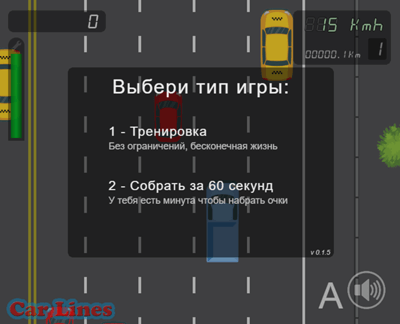
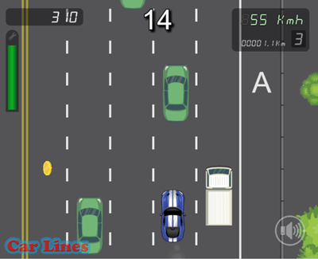

# Car Lines 🏎️. ݁₊ ⊹ . ݁˖ .
#### Простая игра в гонки на Pixi.js 

### Демо: https://pixi-game-cars.vercel.app/

Работает на десктопе 🖥️ и смартфоне 📱. Управление: w,a,s,d,space или touch.





## Stack
Typescript + Pixi.js + Redux Toolkit + Vite + i18n-js + Howler


## Запуск

### Установить npm-зависимости
```
npm i
```
### Запустить сервер
```
npm run dev
```
### Открыть игру в браузере
http://localhost:5173/

